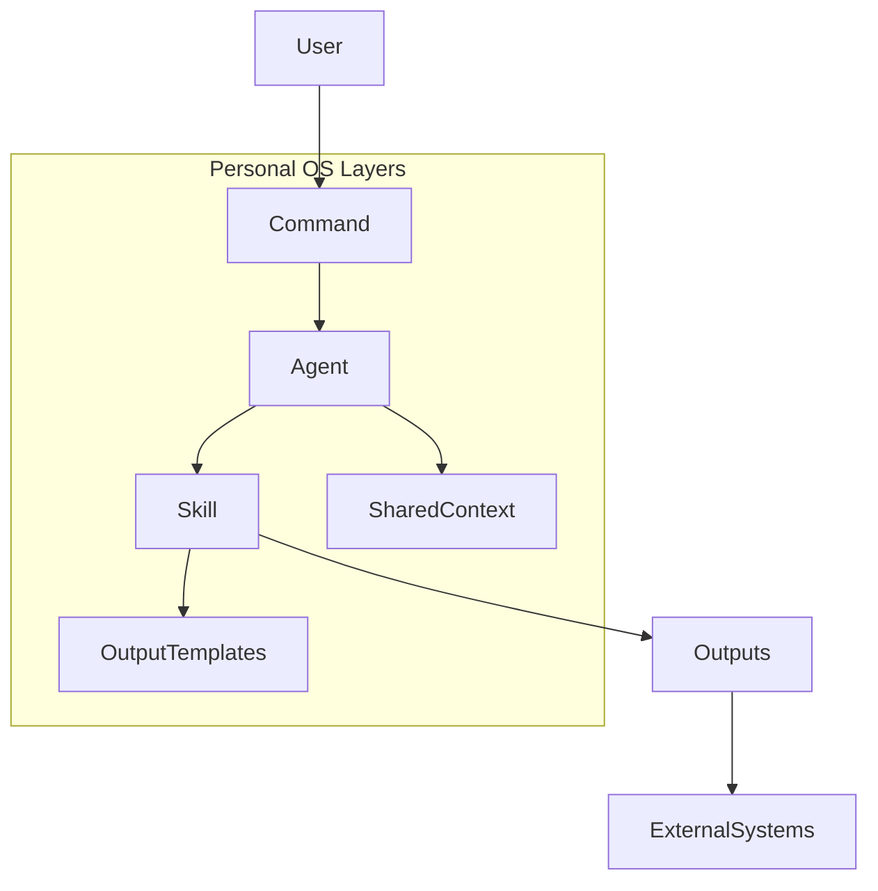

## Personal OS Workflow

### 1. What this system is

The Personal OS is an **AI‑powered productivity system for Product Managers**.  
It combines:

- **Commands**: simple entry points like `/daily-plan` or `/discovery`.
- **Agents**: personas such as `@execution-agent` or `@strategy-agent` that orchestrate work.
- **Skills**: stateless “how‑to” procedures that implement concrete workflows.
- **Shared context**: a single source of truth for your OKRs, priorities, and profile.
- **Automation**: optional Python jobs that run these workflows on a schedule.

If you want to know *“what actually happens when I use this OS?”*, this document is the high‑level guide.

For deeper reference, see:

- Overall system overview: `[README.md](README.md)`
- Conceptual design: `[personal-os-design.md](personal-os-design.md)`
- Automation architecture: `[automation/ARCHITECTURE.md](automation/ARCHITECTURE.md)`
- Automation runtime details: `[automation/AUTOMATION_README.md](automation/AUTOMATION_README.md)`

---

### 2. Architecture and data flow

At the conceptual level (as documented in `README.md`), the system looks like this:

- **Commands** in `[.claude/commands](.claude/commands)` are thin routers.
- **Agents** in `[.claude/agents](.claude/agents)` are personas with orchestration logic.
- **Skills** in `[.claude/skills](.claude/skills)` are stateless procedures that define inputs, steps, and output formats.
- **Shared context** in `[.claude/agents/_shared/context.md](.claude/agents/_shared/context.md)` keeps all workflows aligned to the same OKRs and profile.
- **Output formats** in `[.claude/skills/_shared/output-formats.md](.claude/skills/_shared/output-formats.md)` standardize how results are rendered.
- **Automation code** in `[automation](automation)` (Python) can call the same workflows on a schedule and push outputs to Google Docs, tasks, Slack, etc.

Conceptually, the runtime looks like this:

- **User**: runs a slash command (manually) or a Python scheduler triggers a workflow.
- **Command**: picks an agent + skill and passes control to the agent.
- **Agent**: loads shared context and decides how to execute the skill (and when to hand off).
- **Skill**: follows a clear “Purpose → Inputs → Instructions → Output Format” contract.
- **Output templates**: guarantee that all outputs follow consistent markdown shapes.
- **External systems**: Google Workspace, Slack, task tools, etc., where results may be delivered by the automation layer.

The Python automation system in `[automation](automation)` mirrors this architecture, with:

- `main.py` — scheduler and orchestrator for background jobs.
- `config.py` — loads `.env` and validates configuration.
- `agents/*.py` — code implementations of agents.
- `skills/*.py` — code implementations of skills (e.g. document search, synthesis).
- `utils/google/*.py` — clients for Drive, Docs, Sheets, Slides, Calendar, Tasks, etc.

---

### 3. Commands → agents → skills

This section summarizes how each top‑level command file in `[.claude/commands](.claude/commands)` maps to an agent and a skill, and what workflow it represents.

#### 3.1 Execution (daily operations)

- **`/today`**  
  - **Command file**: `[.claude/commands/today.md](.claude/commands/today.md)`  
  - **Agent**: `@execution-agent` (`[.claude/agents/execution-agent.md](.claude/agents/execution-agent.md)`)  
  - **Skill**: “Today Overview” (`[.claude/skills/execution/today.md](.claude/skills/execution/today.md)`)  
  - **What it does**: question‑free snapshot of today’s schedule and current focus based on your calendar and context.

- **`/daily-plan`**  
  - **Command file**: `[.claude/commands/daily-plan.md](.claude/commands/daily-plan.md)`  
  - **Agent**: `@execution-agent`  
  - **Skill**: “Daily Plan Generation” (`[.claude/skills/execution/daily-plan.md](.claude/skills/execution/daily-plan.md)`)  
  - **Workflow**:
    - Collect today’s meetings, tasks, deadlines, and constraints.
    - Calculate available focus time and energy demands.
    - Choose top 3 priorities that move your OKRs (from shared context).
    - Build a time‑blocked schedule and success criteria for the day.
  - **Output shape**: `Daily Execution Plan` using the **Daily Plan Template** in `[.claude/skills/_shared/output-formats.md](.claude/skills/_shared/output-formats.md)`.

- **`/progress-check`**  
  - **Command file**: `[.claude/commands/progress-check.md](.claude/commands/progress-check.md)`  
  - **Agent**: `@execution-agent`  
  - **Skill**: “Progress Check” (`[.claude/skills/execution/progress-check.md](.claude/skills/execution/progress-check.md)`)  
  - **Workflow**:
    - Ask what has been completed, what’s in progress, and what’s blocked.
    - Score progress vs. the morning plan (1–10).
    - Decide whether you are ahead, on track, or behind.
    - Recommend adjustments and produce a revised afternoon plan.
  - **Output shape**: `Progress Check` markdown as defined in the shared output formats file.

- **`/daily-summary`**  
  - **Command file**: `[.claude/commands/daily-summary.md](.claude/commands/daily-summary.md)`  
  - **Agent**: `@execution-agent`  
  - **Skill**: “Daily Summary” (`[.claude/skills/execution/daily-summary.md](.claude/skills/execution/daily-summary.md)`)  
  - **Workflow**:
    - Capture what was completed, what rolled over, and why.
    - Assign an achievement score and compute completion rate.
    - Document blockers, wins, challenges, and learnings.
    - Draft tomorrow’s top 3 priorities.
  - **Output shape**: `Daily Summary` markdown with achievement score, completed/rolled items, blockers, learnings, and tomorrow’s draft priorities.

#### 3.2 Planning

- **`/sprint-plan`**  
  - **Command file**: `[.claude/commands/sprint-plan.md](.claude/commands/sprint-plan.md)`  
  - **Agent**: `@planning-agent` (`[.claude/agents/planning-agent.md](.claude/agents/planning-agent.md)`)  
  - **Skill**: “Sprint Planning” (`[.claude/skills/planning/sprint-plan.md](.claude/skills/planning/sprint-plan.md)`)  
  - **Workflow**:
    - Gather team capacity (size, sprint length, velocity).
    - Apply a 20% buffer to derive net committable capacity.
    - Prioritize backlog with RICE, MoSCoW, or similar.
    - Map dependencies and risks, define sprint goal and success criteria.
  - **Output shape**: `Sprint Plan` template (capacity, P0/P1/P2 items, dependencies/risks, milestones, DoD, success criteria).

- **`/strategy-check`**  
  - **Command file**: `[.claude/commands/strategy-check.md](.claude/commands/strategy-check.md)`  
  - **Agent**: `@strategy-agent` (`[.claude/agents/strategy-agent.md](.claude/agents/strategy-agent.md)`)  
  - **Skill**: “Strategy Alignment Check” (`[.claude/skills/planning/strategy-check.md](.claude/skills/planning/strategy-check.md)`)  
  - **Workflow**:
    - Ask about current work, recent accomplishments, and near‑term plans.
    - Map each activity to OKRs in shared context.
    - Assess progress per OKR and compute an alignment score.
    - Highlight misaligned work, opportunities, and recommended focus areas.
  - **Output shape**: `Strategy Alignment Check` template with OKR progress table, alignment assessment, recommendations, and strategic questions.

#### 3.3 Research

- **`/discovery`**  
  - **Command file**: `[.claude/commands/discovery.md](.claude/commands/discovery.md)`  
  - **Agent**: `@discovery-agent` (`[.claude/agents/discovery-agent.md](.claude/agents/discovery-agent.md)`)  
  - **Skill**: “Discovery & Research Synthesis” (`[.claude/skills/research/discovery.md](.claude/skills/research/discovery.md)`)  
  - **Workflow**:
    - Collect research inputs (interview notes, feedback, surveys) and context (segments/personas, focus areas).
    - Extract themes, pain points, and notable quotes.
    - Map feature requests to underlying needs and Jobs‑to‑be‑Done.
    - Propose quick wins, items to investigate, and strategic considerations.
  - **Output shape**: `Discovery Insights` template (summary, key themes, pain points, feature‑request mapping, recommendations, open questions).

#### 3.4 Communication

- **`/stakeholder-update`**  
  - **Command file**: `[.claude/commands/stakeholder-update.md](.claude/commands/stakeholder-update.md)`  
  - **Agent**: `@stakeholder-agent` (`[.claude/agents/stakeholder-agent.md](.claude/agents/stakeholder-agent.md)`)  
  - **Skill**: “Stakeholder Update Generation” (`[.claude/skills/communication/stakeholder-update.md](.claude/skills/communication/stakeholder-update.md)`)  
  - **Workflow**:
    - Identify the audience and their concerns.
    - Gather progress, metrics, wins, risks, and decisions needed.
    - Pick the right format (executive, team, weekly report).
    - Lead with impact, be honest about challenges, and make asks explicit.
  - **Output shape**: Executive update, team update, or weekly status report templates as defined in the communication skill.

#### 3.5 Configuration and integrations

These commands don’t produce analysis artefacts; instead they help you configure the OS:

- **`/update-context`**
  - Described in `[.claude/skills/config/update-context.md](.claude/skills/config/update-context.md)`.
  - Interactive wizard to update sections of `[.claude/agents/_shared/context.md](.claude/agents/_shared/context.md)` (OKRs, priorities, sprint focus, profile, stakeholders, roadmap).

- **`/configure-google-workspace`**
  - Described in `[.claude/skills/config/configure-google-workspace.md](.claude/skills/config/configure-google-workspace.md)`.
  - Guides you through Google Cloud project setup, OAuth, credentials storage, env vars, and verification commands in `[automation](automation)`.

- **`/configure-microsoft-teams`**
  - Described in `[.claude/skills/config/configure-microsoft-teams.md](.claude/skills/config/configure-microsoft-teams.md)`.
  - Similar wizard for Microsoft 365 / Graph (Teams, OneDrive, Outlook, SharePoint, Office documents).

#### 3.6 Personal OS hub

- **`/personal-os`**
  - Documented in `[.claude/commands/personal-os.md](.claude/commands/personal-os.md)`.
  - Summarizes all commands and agents and reminds you of the core routing pattern:
    - **Commands → Agents → Skills → (Shared Context)**.

---

### 4. Shared context and output templates

#### 4.1 Shared context (`.claude/agents/_shared/context.md`)

All agents reference a single shared context file:

- Location: `[.claude/agents/_shared/context.md](.claude/agents/_shared/context.md)`
- Contents (as described in `README.md` and `update-context.md`):
  - **User profile** – your name, role, company.
  - **OKRs** – objectives, key results, and targets.
  - **Strategic priorities** – your top 3 focus areas.
  - **Sprint focus** – primary, secondary, and stretch goals.
  - **Stakeholders** – people you work with and their preferences.
  - **Roadmap** – initiatives, timelines, status.

Every agent file (for example `[.claude/agents/execution-agent.md](.claude/agents/execution-agent.md)` or `[.claude/agents/strategy-agent.md](.claude/agents/strategy-agent.md)`) explicitly says:

> Load user context from: `@context:agents/_shared/context`

This ensures:

- Daily plans link tasks to strategic goals.
- Strategy checks map work to OKRs.
- Discovery outputs connect insights back to what matters.
- Stakeholder updates use the right names and expectations.

You can edit this file manually or use `/update-context` for an interactive flow.

#### 4.2 Shared output formats (`.claude/skills/_shared/output-formats.md`)

The file `[.claude/skills/_shared/output-formats.md](.claude/skills/_shared/output-formats.md)` defines reusable templates that many skills refer to with `@template:` references.

Key templates include:

- **Daily Plan Template** – for `/daily-plan`.
- **Progress Check Template** – for `/progress-check`.
- **Daily Summary Template** – for `/daily-summary`.
- **Sprint Plan Template** – for `/sprint-plan`.
- **Strategy Check Template** – for `/strategy-check`.
- **Discovery Insights Template** – for `/discovery`.
- **Executive Update / Team Update Templates** – for `/stakeholder-update`.

Because each skill binds to one of these templates, you can rely on:

- Consistent headings and table structures across outputs.
- Predictable locations for priorities, risks, decisions, and metrics.
- Easy scanning and comparison between days, sprints, or reports.

---

### 5. Automation runtime (Python layer)

The markdown layer describes **what** each workflow does. The Python layer in `[automation](automation)` describes **how and when** these workflows run automatically.

Key docs:

- `[automation/AUTOMATION_README.md](automation/AUTOMATION_README.md)` — high‑level description of the automation system.
- `[automation/ARCHITECTURE.md](automation/ARCHITECTURE.md)` — detailed architecture, data flow, models, and scheduling patterns.
- `[automation/SETUP_GUIDE.md](automation/SETUP_GUIDE.md)` — step‑by‑step setup (Python, .env, Google project, AI keys, etc.).

The default schedule (from `AUTOMATION_README.md`) mirrors the execution workflows:

- **08:00** — Morning Daily Plan (Execution agent workflow).
- **12:30** — Midday Progress Check.
- **17:30** — Evening Summary.
- **Weekly** — Stakeholder discovery / analysis workflow.

In code, `main.py`:

- Loads configuration from `.env` via `config.py`.
- Instantiates the relevant agents (`automation/agents/*.py`).
- Registers jobs with the `schedule` library using times configured in `.env`.
- Runs a loop that triggers workflows at the right times.

Integrations are configured via environment variables (see `.env.example` and `SETUP_GUIDE.md`) and are implemented by:

- `utils/google/*` for Google Workspace.
- (Planned / partial) integrations in `automation/integrations/*` such as Notion or Jira.

The **config skills** (`/configure-google-workspace`, `/configure-microsoft-teams`) do not run the automation directly; they guide you through setting up credentials, env vars, and manual test commands so the Python layer can successfully reach Google/Microsoft APIs.

---

### 6. Extending the system

This section summarizes the patterns described in `README.md`, `personal-os-design.md`, and `automation` docs for adding new capabilities.

#### 6.1 Adding a new skill (markdown layer)

1. **Create the skill file**
   - Put it in the right subdirectory, for example:  
     `+.claude/skills/planning/new-skill-name.md`  
   - Follow the existing structure used by other skills:
     - `Purpose`
     - `Inputs Required`
     - `Instructions` (step‑by‑step)
     - `Output Format` (ideally referencing a template in `skills/_shared/output-formats.md`)
     - `Quality Checks`

2. **Register the skill with an agent**
   - Edit the relevant agent markdown file in `[.claude/agents](.claude/agents)` (for example `planning-agent.md`).
   - Add a row to the **“Skills I Orchestrate”** table mapping:
     - Skill name
     - Command name (if any)
     - When to use it

3. **(Optional) Create a new command router**
   - Add a new command file under `[.claude/commands](.claude/commands)`, similar to existing ones.
   - Document:
     - Agent persona to use.
     - The skill file to execute.
     - The shared context file.
     - What the command does and what inputs the user should provide.

#### 6.2 Extending the automation runtime

The Python layer already includes patterns for adding agents and skills (see `automation/AUTOMATION_README.md` and `automation/ARCHITECTURE.md`):

1. **Add or extend a Python skill**
   - Implement a new class in `automation/skills/*.py` following the documented `Skill` pattern (stateless, explicit `execute()`).

2. **Wire it into a Python agent**
   - Modify or create an agent in `automation/agents/*.py` to call the new skill as part of a workflow.

3. **Schedule it**
   - Update `main.py` to register a new scheduled job or expose a manual entry point.
   - Optionally add new configuration keys in `.env.example` for schedule times or feature flags.

4. **Keep docs in sync**
   - Update the markdown skill and agent files so the **conceptual design** matches how the Python code behaves.
   - If you add a new command, create a matching `.claude/commands/*.md` file.

---

### 7. How to read this library as a new contributor

If you want to understand or modify this Personal OS, a practical reading order is:

1. **High‑level concept**:  
   - `[README.md](README.md)`  
   - `[personal-os-design.md](personal-os-design.md)`
2. **Command, agent, skill contracts**:  
   - `[.claude/commands](.claude/commands)`  
   - `[.claude/agents](.claude/agents)`  
   - `[.claude/skills](.claude/skills)` and `[.claude/skills/_shared/output-formats.md](.claude/skills/_shared/output-formats.md)`  
3. **Shared context**:  
   - `[.claude/agents/_shared/context.md](.claude/agents/_shared/context.md)`  
4. **Automation internals (optional but powerful)**:  
   - `[automation/AUTOMATION_README.md](automation/AUTOMATION_README.md)`  
   - `[automation/ARCHITECTURE.md](automation/ARCHITECTURE.md)`  
   - `[automation/SETUP_GUIDE.md](automation/SETUP_GUIDE.md)`

After that, you should have a clear mental model of:

- How a single command flows through agents and skills.
- How daily/weekly workflows are structured.
- Where to plug in new skills, agents, and integrations without breaking the system’s design principles.

